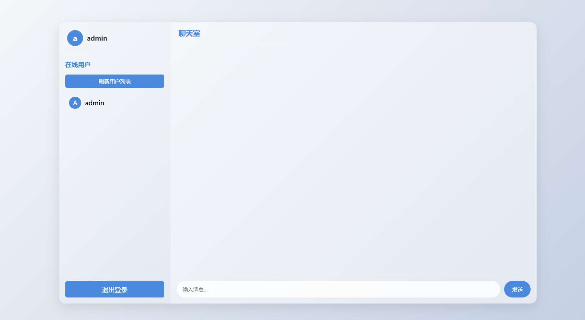

# 简洁聊天室 BY CRWorld

一个基于PHP和JavaScript开发的轻量级实时多人聊天室系统，具有简洁的界面和流畅的用户体验。

## 功能特点

- 实时消息更新
- 在线用户列表
- 用户注册和登录系统
- 美观的毛玻璃UI设计
- 响应式布局，支持各种设备
- 用户在线状态实时更新

## 界面预览

### 登录界面

### 聊天室界面

## 安装说明

1. 确保您的服务器已安装PHP 7.0或更高版本
2. 将项目文件上传到Web服务器目录
3. 确保`data`目录具有写入权限（777）
4. 访问项目URL即可开始使用

## 使用方法

1. 访问聊天室首页
2. 新用户需要先注册账号
3. 使用注册的账号登录系统
4. 登录后即可参与聊天

## 技术栈

- 前端：HTML5、CSS3、JavaScript
- 后端：PHP
- 数据存储：JSON文件
- UI框架：CSS

## 主要特性

- 实时消息推送
- 用户在线状态监测
- 安全的用户认证系统
- 优美的界面设计
- 简单的部署方式

## 开源协议

本项目基于 GNU General Public License v3.0 开源协议。

## Star History

